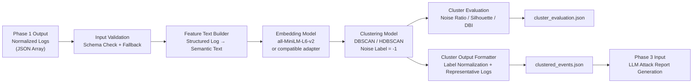
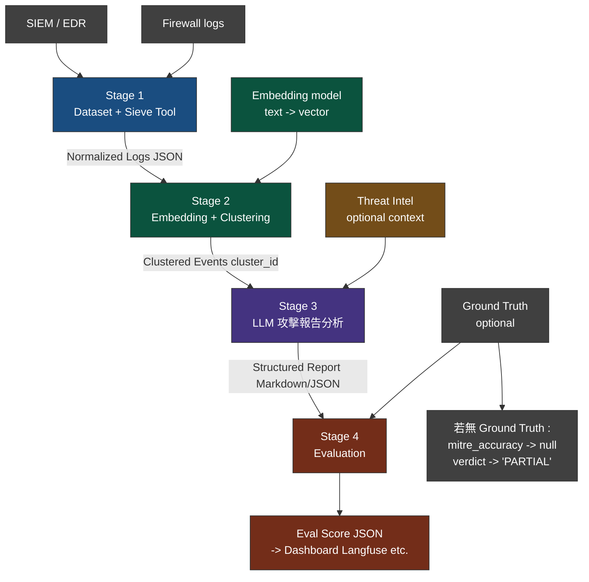

# G91 Component 2: Event Clustering / Embedding Model

**主題: 自動化資安事件分析與評估 Data Pipeline**

- Progress2 分工 (w15)

| 階段 | 工作內容 |
|------|----------|
| 1 | dataset + sieve tool 抓 log |
| 2 | Event Clustering / Embedding Model | <- This Phase
| 3 | LLM 分析 / 攻擊報告生成 |
| 4 | Evaluation |

## Component/Phase 2 核心存在與實作目的

### 1. 緩解海量日誌與 LLM 上下文視窗（Context Window）之限制
資安事件（如暴力破解、APT 橫向移動）通常伴隨大量高重複性的衍生警報。若將海量結構化日誌直接輸入下游 LLM，將導致 Token 溢出、推理延遲與運算成本大幅增加。本組件透過語意空間轉換實施特徵壓縮，旨在大幅縮減下游防禦研判的輸入規模。

### 2. 實現非監督式惡意活動之語意關聯聚合
傳統規則比對（SIEM Correlation Rules）難以識別變種威脅。本組件透過 Embedding 模型將結構化欄位轉譯為高維語意向量，並利用密度分群演算法（DBSCAN），在無標籤前提下，自動將時間、資安實體（IP、User）與行為軌跡具備相似脈絡的離散日誌，聚合為具備獨立威脅上下文的「事件叢集（Event Clusters）」。

### 3. 自動化二次降噪與離群值識別
利用密度分群演算法的噪訊識別特性，自動將未達密度門檻的零散或孤立事件標記為噪訊標籤（`-1`），在進入下游 LLM 研判前完成二次降噪，確保分析流精準聚焦於結構明確的異常威脅群集。

### 4. 建構確定性（Deterministic）攻擊時間線基準
為確保下游 LLM 精確還原攻擊生命週期，本組件依據時間戳記對叢集內日誌進行確定性遞增排序並提取前 $N$ 筆代表性日誌，消除非監督式學習之隨機性干擾，為下游建構 MITRE ATT&CK 映射報告奠定穩固的數據基準。


## Structure for Component 2

### 專案檔案結構:

```
phase2_project/
├── config/
│   └── phase2_config.json                 # 全域參數配置檔：管理輸入/輸出路徑、模型名稱與分群參數（eps, min_samples）
│
├── data/
│   └── normalized_logs_sample.json       # 測試基準 Mock Data：存放 80–150 筆內含四大語意特徵的標準化結構日誌
│
├── output/                                # 交付物儲存目錄：存放 Pipeline 執行成功後產出的事件群集與品質評估報告
│
├── src/
│   ├── __init__.py
│   │
│   ├── adapters/                          # 模型與演算法轉接層：落實轉接器模式，隔離底層第三方機器學習庫
│   │   ├── __init__.py
│   │   ├── embedding_adapter.py           # 向量化轉接器：封裝 all-MiniLM-L6-v2，提供 encode 介面並輸出維度摘要
│   │   └── clustering_adapter.py          # 分群演算法轉接器：封裝 DBSCAN，將離群事件標記為 -1 並保留升級擴充性
│   │
│   └── utils/                             # 基礎組件與工具模組：負責處理結構化資料轉換、統計與驗證等原子化任務
│       ├── __init__.py
│       ├── log_loader.py                  # 資料輸入端點：實作 load_logs()，讀取外部 JSON Array 檔案
│       ├── log_validator.py               # 資料清洗與檢驗：實作 validate_logs()，執行 Schema 檢查、無效日誌剔除與欄位補值
│       ├── text_builder.py                # 特徵工程文本合成：實作 build_feature_texts()，按樣板展平欄位並執行 256 token 截斷估算
│       ├── evaluator.py                   # 品質監控與驗證：實作 evaluate_clusters()，驗證硬性不變量約束與計算幾何品質指標
│       └── output_formatter.py            # 交付資料標準化：實作 format_clustered_events()，重映穩定標籤並選取代表性日誌
│
└── phase2_embedding_clustering.py        # 核心流程控制與進入點：專案執行入口，不含業務邏輯，僅負責調度各模組串接 Pipeline 資料流
```

### 資料流:

本階段採用配置驅動（Config-driven）與轉接器模式（Adapter Pattern）設計，確保底層模型與分群演算法升級時，主流程架構無需重構。資料流依序為：Log Loader → Schema Validator → Feature Text Builder → Embedding Encoder → Clustering Engine → Cluster Quality Evaluator → Cluster Output Formatter。



### Output 說明

本元件會輸出兩個標準化 JSON 檔案：

1. clustered_events.json
    - 是具備特定威脅上下文的事件結構體陣列，作為 Phase 3 LLM 分析模組 Input。
    - 將原始日誌轉換為語意群集（event clusters），並提供代表性事件、時間範圍與關聯實體資訊，以支援後續攻擊鏈分析與事件摘要生成。

2. cluster_evaluation.json
    - 作為本原件分群品質與 Pipeline 健康狀態的評估報告，
    - 記錄資料清洗統計、分群分布、噪訊比例與幾何指標，用於判斷 clustering 結果是否具備分析價值。

## subcomponents Description

### 1. 全域參數配置 (config/phase2_config.json)

* **採用策略與核心內容**：實作配置驅動（Config-driven）架構。集中管理 I/O 路徑、特徵樣板版本、向量化模型名稱與分群超參數（`eps`, `min_samples`），將業務參數與核心邏輯解耦，提供 Pipeline 後續調整與模型替換彈性。

### 2. 資料輸入端點 (src/utils/log_loader.py)

* **採用策略與核心內容**：封裝原子化 I/O 任務。實作 `load_logs()` 讀取外部 JSON Array 檔案，負責檔案存在性檢查與基本反序列化，為 Pipeline 提供統一的資料輸入起點。

### 3. 資料清洗與檢驗 (src/utils/log_validator.py)

* **採用策略與核心內容**：落實契約式設計（Design by Contract）與失敗外顯（Fail-Fast）機制。實作 `validate_logs()` 執行 Schema 驗證、無效日誌剔除、`raw_message` fallback 與缺失欄位標準化補值（預設 `"unknown"`），作為 Pipeline 的唯一資料准入閘口，確保後級組件可依 strict contract 直接存取必要欄位。

### 4. 特徵工程文本合成 (src/utils/text_builder.py)

* **採用策略與核心內容**：執行語意展平與長度控制。實作 `build_feature_texts()`，將結構化日誌欄位依據指定樣板版本整合為語意特徵文本；內部採用 whitespace token count 估算 256 tokens 長度門檻，用於追蹤文本過長與潛在截斷風險。

### 5. 向量化轉接器 (src/adapters/embedding_adapter.py)

* **採用策略與核心內容**：落實轉接器模式（Adapter Pattern）與延遲載入（Lazy Initialization）。封裝 `SentenceTransformer`（預設 `sentence-transformers/all-MiniLM-L6-v2`），將 feature texts 編碼為 NumPy 語意向量矩陣，並輸出模型名稱、向量維度與正規化狀態等 metadata，隔離底層機器學習庫與主流程。

### 6. 分群演算法轉接器 (src/adapters/clustering_adapter.py)

* **採用策略與核心內容**：實作無監督事件分群。封裝 `DBSCAN` 演算法，基於設定檔指定之餘弦距離（Cosine Metric）與密度分群參數執行向量空間分群，並將未歸群事件標記為 `-1`（noise label），保留後續替換 HDBSCAN 或其他分群演算法的擴充空間。

### 7. 品質監控與驗證 (src/utils/evaluator.py)

* **採用策略與核心內容**：實作分群品質評估與健全性防護。實作 `evaluate_clusters()` 計算 cluster 數量、noise ratio、cluster size distribution、Silhouette Score 與 Davies-Bouldin Index；當有效群集數量小於 2 時，幾何指標輸出 `null` 並寫入 `evaluation_notes`，同時針對 noise ratio 過高（`> 0.70`）或過低（`< 0.05`）產生 warning，避免極端分群結果中斷 Pipeline。

### 8. 交付資料標準化 (src/utils/output_formatter.py)

* **採用策略與核心內容**：維護前後級組件契約與確定性輸出。實作 `format_clustered_events()`，將 raw cluster labels 映射為穩定格式（如 `cluster_000` / `noise`），依 timestamp 遞增排序選取前 N 筆 representative logs，並聚合去重後的資安實體（IPs, Users, Event IDs），產出符合 Phase 3 LLM 分析需求的 `clustered_events.json`。

### 9. 主控制流程進入點 (phase2_embedding_clustering.py)
* **採用策略與核心內容**：實作流程編排層（Orchestration Layer）。作為 Component 2 的核心進入點，本身不承載核心業務邏輯，僅負責調度與串接配置載入、資料讀取、 Schema 驗證、特徵合成、向量編碼、密度分群、幾何評估與輸出格式化流程，為 W16 與其他階段組件對接提供穩定的單一主控入口。

> 詳情定義於 phase2_sdd_v1.md 文件 (期末文件若有需要再附上，避免本報告篇幅過長)

## Development & Implementation

### Steps Overview

- 創建檔案結構 (Development Steps)
    - 創建 config (.json)，提供全域參數給 log_loader、EmbeddingAdapter 與 ClusteringAdapter。
    - 創建 data (.json)，使用 Gemini 生成 80 筆 mock data for 後續資料處理。
    - 創建 log_loader.py & log_validator.py for Input 資料讀取與驗證篩選。
        - load_logs(): 讀取外部 JSON Array 檔案。
        - validate_logs(): 執行日誌 Schema 驗證與補值。
        - 輸出 valid_logs 供後續所有模組使用
    - 創建 text_builder.py，將結構化日誌欄位轉換為語意特徵文本。
        - valid_logs 已由 log_validator.py 保證欄位完整性，本 Script 不處理缺值。
    - 創建 embedding & clustering Adapters
        - embedding_adapter.py: 將語意特徵轉換為語意向量 (embeddings)，for 後續 clustering 使用
        - clustering_adapter.py: 負責將 embeddings 進行分群並輸出 raw cluster labels，for 後續 formatter 與 evaluator 使用
    - 創建 evaluator.py，負責計算分群品質指標與資料統計，並符合後續 output_formatter 規範。
    - 創建 output_formatter.py，利用 labels + valid_logs 建立 clustered_events.json 所需結構
    - 創建 phase2_embedding_clustering.py，實作專案主程式入口，負責調度各模組串接 Pipeline 資料流
- 建置環境並執行主程式
- 分析結果與後續優化串接

### 環境建立 & Quick Start

建置環境說明:
- Windows WSL2 Ubuntu 20.04
- (venv) Python 3.10
- conda 25.9.1


```bash
# 0. Check & Launch Ubuntu 20.04
wsl -l -v
wsl -d Ubuntu-20.04

# 1. 建立獨立的 Conda 虛擬環境（指定 Python 3.10）
conda create -n llm_emb_clust python=3.10 -y

# 2. 啟用該虛擬環境
conda activate llm_emb_clust

# 3. install packages
conda install -c conda-forge numpy scikit-learn -y

# 4. 安裝向量化模型套件
pip install sentence-transformers

# 5. 驗證 torch 是否正常 => 2.12.0+cu130
python -c "import torch; print(torch.__version__)"

# 6. 執行完整事件分群 Pipeline
python phase2_embedding_clustering.py
```

## Result Analysis & Future Work


### Result 1: 分群結果


本階段輸出之 `clustered_events.json` 會將原始日誌依語意相似性聚合為多個事件 cluster，每個 cluster 對應一類具備相近行為特徵的事件模式（如權限提升、掃描、規避等）。

以下展示其中一個 cluster（`cluster_000`）之輸出結果: 

1. 在此 cluster 中，共聚合 `28` 筆語意相近的事件，時間範圍集中於 `2026-05-27T10:00:01Z` 至 `2026-05-27T10:10:10Z`。`representative_logs` 會依 timestamp 遞增排序，保留前 N 筆代表性事件，以降低後續 LLM 分析時的 token 消耗，同時維持主要行為脈絡。
2. 從代表性事件可觀察到一系列與 `sudo` 相關的操作，例如帳號建立（`useradd`）、權限提升（`usermod -aG sudo`）與切換至 root（`sudo su - root`），顯示此 cluster 主要聚焦於「Privilege Escalation」相關行為。
3. 此外，`involved_entities` 會聚合並去重 cluster 內涉及的 IP、使用者與 event id，提供後續 Phase 3 攻擊分析模組可直接使用的結構化上下文資訊。

### Result 2: 評估報告


cluster_evaluation.json 用於紀錄分群結果的品質指標與系統健康度，其核心解讀如下：

1. 資料完整性 (input_summary)：輸入的 80 筆日誌全數通過檢驗（無效資料為 0），確認前段資料清洗邏輯正確。
2. 分群結果與降噪能力 (clustering_summary)：
    - 系統成功聚合出 1 個核心事件群（28 筆）。其餘 52 筆相似度不足的日誌被歸類為 noise（未形成有效群集）。
    - 高達 65% 的 noise ratio，反映目前僅部分事件能形成明顯的語意群集。
3. 例外防護機制 (quality_metrics)：
    - 因進階的分群品質指標（如群集間的距離計算）需至少兩個有效群集才能運作，系統已自動將指標設為 null 並記錄原因，避免在 cluster 數量不足時執行無效指標計算。

整體而言，本結果顯示目前 Pipeline 已能成功：
    - 完成 embedding 與密度式分群
    - 區分高密度事件與離群事件（noise）
    - 輸出結構化 cluster 統計與品質資訊

此結果反映目前 embedding 與 DBSCAN 參數設定下，事件語意分布仍偏稀疏，後續可透過調整 `eps`、`min_samples` 或 feature text template 改善 cluster 分離度。


### 現階段執行結果與根因診斷

**核心觀察指標統計**

| 指標項目 | 數據值 | 狀態與品質評估 |
| :--- | :--- | :--- |
| 輸入日誌總量 (`input_log_count`) | 80 筆 | [正常] 全數通過 Schema 驗證 |
| 有效群集數量 (`number_of_clusters`) | 1 (`cluster_000`) | [警示] 目前僅形成單一有效群集 |
| 噪訊總量與比例 (`noise_count` / `noise_ratio`) | 52 筆 / 65% | [警示] noise 比例偏高，接近 0.70 警示邊界 |
| 幾何品質指標 | null | [警示] 有效群集數少於 2，Silhouette / DBI 不具計算意義 |

**根因診斷：Mock Data、Feature Template 與 DBSCAN 參數**

* 本階段 Pipeline 已可正常執行，包含驗證、特徵合成、向量化、分群、評估與輸出，未發生系統級錯誤。
* 目前結果顯示，DBSCAN 在現有設定（`eps = 0.25`, `min_samples = 3`）下，僅將 Privilege Escalation 相關事件聚合為 `cluster_000`，其餘 52 筆事件被標記為 noise。此結果表示 Component 2 已能聚合部分高相似度事件，但尚未達到預期的多類語意群集分離效果。
* 可能影響因素如下：
    1. Mock Data 分布可能影響結果：目前 80 筆 mock data 雖然格式正確，但其語意分布是否足以形成多個穩定密度群集仍需觀察。若部分類別樣本數不足、同類事件描述不夠一致，或不同類別語意邊界不明顯，DBSCAN 可能僅能保留最密集的一群。
    2. Feature Template 可能稀釋核心行為語意：現行 `v1` template 包含 timestamp、IP、user、event id 與 action。此設計保留完整上下文，但也可能降低 `process_action_details` 在 embedding 中的相對權重。
    3. DBSCAN 參數尚未校準：`eps = 0.25` 與 `min_samples = 3` 目前可形成單一有效群集，但尚未能穩定產生多個可解釋 cluster。後續需在實際 W16 資料流接入後再重新觀察。
* 目前不建議立即判定 mock data、模型或演算法任一項為單一主因。較合理的處理方式是：先完成 W16 串接，觀察 Phase 1 實際 normalized logs 的資料分布，再決定是否進入參數與特徵模板調整。

### Future Work 優先序與後續串接策略

後續首要任務是完成跨 Component 資料流貫通，而非在隔離環境中追求單一組件的分群品質最佳化。因此後續工作分為以下三個層級：

**1. [P0] W16 端到端資料流貫通 (Phase 1 → Phase 2 → Phase 3)**

* **執行任務**：停止對 Component 2 進行隔離調校。直接將 Phase 1 (Log Sieve) 產出之實際 `normalized_logs` 接入 Component 2，並將產出之 `clustered_events.json` 交付 Phase 3 (LLM 分析模組)。
* **目的**：驗證全域 Pipeline 合約。確認 Phase 3 能正確解析 `cluster_id`、`representative_logs` 等結構，並基於真實資料之叢集生成攻擊分析報告。
* **重點**：此階段純粹確立 API Contract 與資料流管線，絕對不進行模型替換或演算法微調。

**2. [P1] 串接後之真實分布觀測**

* **執行任務**：在全系統貫通狀態下，觀察 Component 2 面對 Phase 1 真實日誌時之分群表現。
* **觀察指標**：
    * `number_of_clusters`
    * `noise_ratio`
    * `cluster_size_distribution`
    * `representative_logs` 是否具備語意一致性
* **判斷方式**：
    * 若真實資料自然形成多個可解釋之 cluster，代表目前 baseline 架構具備泛化能力，予以保留。
    * 若仍維持單一 cluster 或異常之 noise ratio，始確立為 Component 2 本體之特徵與邊界問題，推進至 P2。

**3. [P2] 條件式輕量優化 (視 P1 觀測結果啟動)**

> 若 P1 觀測確立分群失效，再嚴格限制於以下低成本改動。

* **Feature Template v2 降噪**
    * 將核心指令 `process_action_details` 置前。
    * 降低 timestamp 與 IP 等非行為欄位在特徵文本中之權重比。
    * 透過設定檔之 `feature_template_version` 進行切換，確保主流程代碼不變。
* **DBSCAN 邊界校準**
    * 放棄靜態盲測。針對真實 embedding 執行 `eps` 與 `min_samples` 的科學化掃描（Sweep）。
    * 調校基準以 cluster 數量與 representative logs 的語意純度為主，不盲目追求幾何品質分數。
* **重型優化之凍結**
    * 模型替換（如 `all-MiniLM-L6-v2` 升級）、演算法替換（HDBSCAN）與 fine-tuning 屬高成本重構，於 W16 初始串接與 P2 輕量調校未窮盡前，一律凍結執行。


---

# 資安日誌分析與攻擊報告生成系統規格書 (Data Pipeline Specifications)

本文檔定義了「資安日誌分析與攻擊報告生成系統」四個核心階段的輸入（Input）與輸出（Output）資料規格、評估機制及整體落地架構，以確保端到端（End-to-End）資料流的整合性與嚴謹度。

## Pipeline

1. dataset + seive tool 抓 log
2. model 事件分群 / embbeding model 
3. LLM 分析 攻擊報告 
4. Evaluation



## 1. Dataset + Sieve Tool 抓 Log

本階段核心在於從異質資料源中，過濾、清洗並提取出與潛在攻擊關聯的關鍵欄位，最大化消除背景噪訊。

### 1.1 輸入 (Input)
* **原始日誌串流/檔案 (Raw Logs)**：來自 SIEM、防火牆、EDR、Windows Event Logs、Linux Syslog 或 VPC Flow Logs 的原始 JSON、CSV 或 Syslog 文本。
* **過濾規則 (Sieve Rules/Signatures)**：已知惡意特徵（如特定 IOC、特定惡意指令字串）、特定時間區間篩選條件、高風險事件 ID (Event ID) 篩選列表。

### 1.2 輸出 (Output)
* **結構化標準日誌 (Normalized Logs)**：過濾後的精簡日誌陣列，每筆日誌格式皆完成標準化（Normalization）。
    ```json
    [
      {
        "timestamp": "2026-05-27T10:00:00Z",
        "source_ip": "192.168.1.50",
        "dest_ip": "10.0.0.5",
        "event_id": "4688",
        "actor_user": "admin",
        "process_action_details": "sudo rm -rf /var/log/nginx",
        "raw_message": "May 27 10:00:00 host sudo: admin : TTY=pts/0 ; PWD=/home/admin ; USER=root ; COMMAND=/bin/rm -rf /var/log/nginx"
      }
    ]
    ```

## 2. Model 事件分群 / Embedding Model

本階段核心在於將巨量的結構化日誌，透過語意向量化與非監督式學習算法，聚合為數個獨立的「事件叢集（Event Clusters）」，以便進行批次威脅上下文分析。

### 2.1 輸入 (Input)
* **結構化標準日誌**：第 1 階段輸出之標準化日誌陣列。
* **特徵組合文本 (Text for Embedding)**：將每筆日誌的關鍵欄位組合成具備語意的特徵字串。
    * *範例*：`"User admin executed sudo rm -rf from IP 192.168.1.50 to 10.0.0.5 at 2026-05-27T10:00:00Z"`

### 2.2 輸出 (Output)
* **事件分群清單 (Clustered Events)**：以群組 ID（Cluster ID）為單位的結構化 JSON 陣列。
* **[實作保留條件]**：`representative_logs` 暫定為純字串陣列。為確保第 3 階段 LLM 精確排列攻擊時間線，後續工程實作時可評估將其修改為包含時間戳記的物件陣列（Object array with timestamps）。
    ```json
    {
      "cluster_id": "cluster_042",
      "total_count": 128,
      "time_range": {
        "start": "2026-05-27T10:00:00Z",
        "end": "2026-05-27T10:15:00Z"
      },
      "representative_logs": [
        "User admin executed sudo rm -rf from IP 192.168.1.50 at 10:00:00",
        "User admin cleared bash_history from IP 192.168.1.50 at 10:05:00"
      ],
      "involved_entities": {
        "ips": ["192.168.1.50", "10.0.0.5"],
        "users": ["admin"]
      }
    }
    ```

## 3. LLM 分析 攻擊報告

本階段將特定事件叢集的日誌資料與上下文輸入至大型語言模型（LLM），由其扮演高階資安專家（SOC Tier 3 Analyst），推導出具備完整脈絡的資安事件分析報告。

### 3.1 輸入 (Input)
* **特定叢集日誌內容**：第 2 階段輸出之特定 `cluster_id` 完整內容（包含代表性日誌、受影響實體與時間線）。
* **系統提示詞 (System Prompt)**：定義資安專家角色、推論邏輯邊界限制，以及報告標準格式要求（必須包含 MITRE ATT&CK 映射）。
* **外部上下文威脅情報 (Threat Intel Context)** *(選填)*：當前最新的威脅情資、已知攻擊者手法、相關漏洞資訊（CVE 描述）。

### 3.2 輸出 (Output)
* **攻擊事件報告 (Structured Attack Report)**：高度結構化的 Markdown 文本或 JSON 格式報告。
    ```markdown
    # 攻擊事件分析報告 - Cluster 042
    
    ## 1. 攻擊概述 (Summary)
    偵測到源自 192.168.1.50 的憑證權限提升與日誌清除行為，意圖掩蓋軌跡。
    
    ## 2. 攻擊時間線 (Timeline)
    * `10:00:00` - 用戶 admin 提權執行關鍵目錄刪除。
    * `10:05:00` - 清除歷史紀錄以隱蔽蹤跡。
    
    ## 3. MITRE ATT&CK 映射
    * **Tactic**: Defense Evasion (TA0005)
    * **Technique**: Indicator Removal (T1070)
    
    ## 4. 修復建議 (Remediation)
    隔離 IP 192.168.1.50，並停用 admin 帳號進行全面鑑識。
    ```

## 4. Evaluation (評估)

本階段透過自動化評估框架或觀測平台，驗證第 3 階段 LLM 生成報告的正確性、忠實度（有無幻覺）及資安專業判讀準確度，並將結果輸出至視覺化評分網站。

### 4.1 輸入 (Input)
* **預期黃金標準 (Ground Truth / Reference)** *(選填)*：資安專家預先針對該日誌集群標記的正確攻擊鏈與正確 MITRE 標籤。
* **原始上下文 (Context)**：第 2 階段輸入給 LLM 的原始日誌與集群上下文資訊。
* **實際輸出報告 (Actual Output)**：第 3 階段 LLM 實際生成的攻擊事件報告。

### 4.2 輸出 (Output)
* **評估指標得分 (Evaluation Metrics Score)**：量化的評分數據 JSON，直接推送至評分網站 Dashboard。
* **[條件式推理]**：若輸入之「預期黃金標準 (Ground Truth)」為缺失狀態，系統無法進行標準答案比對，此時 `scores` 中的 `mitre_accuracy` 欄位必須輸出 `null`，且整體 `verdict` 應降級輸出為 `"PARTIAL"`。
    ```json
    {
      "report_id": "rep_20260527_001",
      "cluster_id": "cluster_042",
      "scores": {
        "faithfulness": 0.95,
        "answer_relevance": 0.88,
        "mitre_accuracy": 0.90 
      },
      "verdict": "PASS",
      "cost_and_latency": {
        "tokens": 4120,
        "latency_sec": 8.5
      }
    }
    ```
    *(註：當 Ground Truth 為缺失狀態時，預期輸出範例為 `"mitre_accuracy": null` 且 `"verdict": "PARTIAL"`)*

## 五、 現有的 Evaluation 評分網站與框架

針對第四階段（Evaluation），業界與開源社群現有的視覺化評分與觀測解決方案如下：

### 1. 開源與專業資安評估框架 (可整合自建 UI)
* **DeepEval (Confident AI)**：被稱為 LLM 的 Pytest。提供現成的開源評估指標（如 G-Eval、正確性、幻覺度），並內建一個**評分網站 Dashboard**，可批次運行並在網頁上查閱得分趨勢。
* **LogEval / CyberBench**：學術與工業界針對「日誌分析」與「資安報告」打造的基準測試框架，定義了日誌異常檢測與摘要的評分標準（包含 Precision, Recall, F1-score）。

### 2. 商用/雲端 LLM 評估與觀測平台 (內建完整評分網站)
* **Langfuse / Phoenix (Arize AI) / LangSmith**：提供完整的 Web UI Dashboard。系統執行時透過 SDK 將第 1 到第 3 步的完整 Trace 紀錄下來，支援 **LLM-as-a-Judge** 自動評分或 **人工審查（Human-in-the-loop）** 介面（由資安專家在網頁上直接進行得分/扣分與打標籤）。

## 六、 最終報告評分指標設計 (Evaluation Metrics)

為確保評分網站能正確顯示「是否正確/得分」，評估模組應包含以下三個維度的核心指標：

| 評估維度 | 指標名稱 | 評估核心邏輯 |
| :--- | :--- | :--- |
| **事實正確性** | 實體提取準確度 | 檢查報告中的 IP、主機名、Hash 是否完全存在於原始 Log 中，防範 LLM 憑空捏造。 |
| | 時間線正確性 | 驗證報告推導的攻擊步驟順序，是否與 Log 中的 Timestamp 先後順序相符。 |
| **資安專業對齊** | MITRE ATT&CK 對齊度 | 利用 LLM-as-a-Judge，比對報告判定的 Tactic/Technique 是否與標準答案或黃金數據集一致。 |
| | 威脅嚴重級別評估 | 驗證 LLM 給出的風險評級（高/中/低）或 CVSS 分數是否客觀合理。 |
| **摘要品質** | 噪訊消除率 | 評估最終報告是否成功剔除了無關的正常背景日誌，準確聚焦於真實威脅。 |