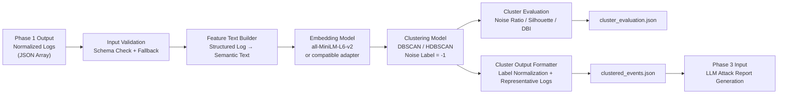
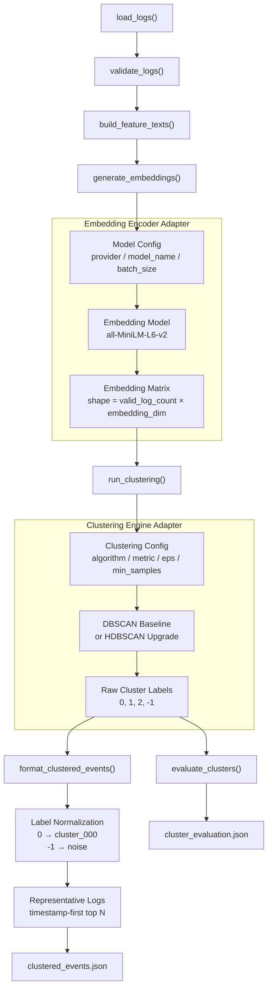

# Phase 2 軟體設計說明書 (SDD) — Embedding Model / Event Clustering

## 1. 輸入規格與測試資料集規範 (Input & Mock Data)

### 1.1 輸入來源與 Schema 定義

Phase 2 的直接輸入源為 Phase 1 產出的標準化結構日誌（Normalized Logs），輸入格式固定為 JSON Array。單筆 Log 物件之欄位定義與驗證規則如下表所示：

| 欄位名稱 | 類型 | 說明 | 缺失與異常處理規則 |
| --- | --- | --- | --- |
| `log_id` | String | 唯一識別碼 | 視為無效日誌（Invalid），直接剔除。 |
| `timestamp` | String | ISO 8601 時間戳記 | 視為無效日誌（Invalid），直接剔除。 |
| `process_action_details` | String | 行為核心語意文本 | 主要語意欄位。若缺失則自動回退（Fallback）至 `raw_message`；若兩者皆缺失則視為無效日誌剔除。 |
| `source_ip` | String | 來源 IP 位址 | 允許缺失，系統自動補值為 `"unknown"`。 |
| `dest_ip` | String | 目的 IP 位址 | 允許缺失，系統自動補值為 `"unknown"`。 |
| `actor_user` | String | 執行使用者帳號 | 允許缺失，系統自動補值為 `"unknown"`。 |
| `event_id` | String | 安全事件識別碼 | 允許缺失，系統自動補值為 `"unknown"`。 |
| `raw_message` | String | 原始日誌文本 | 選填。僅作為 `process_action_details` 缺失時之備用特徵。 |

### 1.2 測試用 Mock Data 生成規範

為確保 Pipeline 具備獨立驗證能力，本階段設計 `normalized_logs_sample.json` 作為測試基準。生成應符合以下參數限制：

* **資料規模**：總日誌量控制在 80–150 筆。
* **分佈比例**：惡意/可疑日誌（Attack-related Logs）佔 30–40%；正常背景日誌（Benign Logs）佔 60–70%。
* **語意群集設計**：必須明確涵蓋以下四類行為特徵，以驗證非監督式演算法的語意邊界：
  1. **權限提升 (Cluster A)**：包含高度相似的 `process_action_details`（如多種 sudo 提權與提權嘗試行為）。
  2. **防禦規避 (Cluster B)**：清除歷史紀錄或刪除系統日誌行為（如 `rm -rf /var/log/nginx`、`history -c`）。
  3. **網路掃描/橫向移動 (Cluster C)**：異常連接行為，如連接埠掃描、內網橫向檢索。
  4. **背景噪訊 (Noise/Benign)**：例行性備份、正常系統登入、排程健康檢查等日常背景事件。


---

## 2. 核心組件架構與實作方法 (Component Implementation)

本階段採用配置驅動（Config-driven）與轉接器模式（Adapter Pattern）設計，確保底層模型與分群演算法升級時，主流程架構無需重構。資料流依序為：`Log Loader` → `Schema Validator` → `Feature Text Builder` → `Embedding Encoder` → `Clustering Engine` → `Cluster Quality Evaluator` → `Cluster Output Formatter`。

```text
+------------+     +-----------+     +--------------+     +-----------+
| Log Loader | --> | Schema    | --> | Feature Text | --> | Embedding |
|            |     | Validator |     | Builder      |     | Encoder   |
+------------+     +-----------+     +--------------+     +-----------+
                                                                |
+------------+     +-----------+     +--------------+           |
| Output     | <-- | Quality   | <-- | Clustering   | <---------+
| Formatter  |     | Evaluator |     | Engine       |
+------------+     +-----------+     +--------------+
```



專案檔案結構:

```text
phase2_project/
├── config/
│   └── phase2_config.json
│
├── data/
│   └── normalized_logs_sample.json
│
├── output/
│
├── src/
│   ├── __init__.py
│   │
│   ├── adapters/
│   │   ├── __init__.py
│   │   ├── embedding_adapter.py
│   │   └── clustering_adapter.py
│   │
│   └── utils/
│       ├── __init__.py
│       ├── log_loader.py
│       ├── log_validator.py
│       ├── text_builder.py
│       ├── evaluator.py
│       └── output_formatter.py
│
└── phase2_embedding_clustering.py
```

### 2.1 配置驅動參數結構 (Config-Driven Structure)

所有模型、分群演算法與輸出參數必須由 config 管理，不得寫死於主流程。此設計用於確保 MVP 階段使用 `all-MiniLM-L6-v2 + DBSCAN`，但後續可在不改動 pipeline 主流程的情況下無縫替換 embedding model 或 clustering algorithm，將向下兼容落實為工程約束。全域設定檔範例如下：

```json
{
  "input_path": "normalized_logs_sample.json",
  "feature_template_version": "v1",
  "embedding": {
    "provider": "sentence_transformers",
    "model_name": "sentence-transformers/all-MiniLM-L6-v2",
    "normalize_embeddings": true,
    "batch_size": 32
  },
  "clustering": {
    "algorithm": "DBSCAN",
    "metric": "cosine",
    "eps": 0.25,
    "min_samples": 3
  },
  "output": {
    "clustered_events_path": "clustered_events.json",
    "cluster_evaluation_path": "cluster_evaluation.json",
    "representative_log_count": 5,
    "include_noise": false
  }
}

```

### 2.2 核心組件實作與函式對應

本階段實作以 `phase2_embedding_clustering.py` 為主程式。各組件與實作函式對應如下：

* **Log Loader** → `load_logs()`
* **Schema Validator** → `validate_logs()`
* **Feature Text Builder** → `build_feature_texts()`
* **Embedding Encoder Adapter** → `generate_embeddings()` / `EmbeddingAdapter.encode()`
* **Clustering Engine Adapter** → `run_clustering()` / `ClusteringAdapter.fit_predict()`
* **Cluster Quality Evaluator** → `evaluate_clusters()`
* **Cluster Output Formatter** → `format_clustered_events()`

W15 MVP 可先採 function-based implementation；Adapter class 為後續模型升級保留的介面設計。開發時需至少確保函式輸入輸出與 Adapter 介面相容。



### 2.3 核心組件實作細節

#### 1. Log Loader & Schema Validator

讀取外部 JSON Array 檔案。依據 1.1 節規則進行過濾與補值，統計並將 `invalid_log_count` 與欄位補值次數寫入評估摘要。

#### 2. Feature Text Builder

將結構化欄位展平為富含上下文語意的連續文字。實作約束如下：

1. `process_action_details` 為主要語意欄位，必須保留。
2. `raw_message` 不預設加入 feature text，僅作為 fallback。
3. `timestamp`、`source_ip`、`dest_ip` 可保留於文字中，但不可取代行為語意欄位。
4. Feature template 必須透過 `feature_template_version` 參數控制，避免未來調整樣板時改動主流程。
5. W15 baseline 使用 whitespace token count 估算長度，截斷風險門檻建議設為 256 tokens。

* **預設樣板 (v1)**：
```text
At {timestamp}, user {actor_user} triggered event {event_id}: {process_action_details}. Source IP: {source_ip}. Destination IP: {dest_ip}.

```


#### 3. Embedding Encoder Adapter

W15 MVP 不強制完整 class hierarchy。可先以 `generate_embeddings()` 函式包裝模型呼叫，但回傳內容必須包含 `embeddings` 與 `embedding_summary`。其中 `embedding_summary` 至少包含：

```json
{
  "provider": "sentence_transformers",
  "model_name": "sentence-transformers/all-MiniLM-L6-v2",
  "embedding_dimension": 384,
  "normalized": true
}

```

後續若改為完整 Adapter class，主流程只需改動 adapter 初始化，不應改動資料流順序。

#### 4. Clustering Engine Adapter

W15 預設實作採用 `DBSCAN` 演算法（參數設定：`metric="cosine"`, `eps=0.25`, `min_samples=3`）。未成功歸群的離群事件（Outliers），統一標記其群集標籤（Cluster Label）為 `-1`。

* **Cluster label normalization 約束**：
Clustering algorithm 產出的原始 label 不應直接暴露給 Phase 3。Formatter 應將有效 cluster label 重新映射為穩定格式：
* `0` → `cluster_000`
* `1` → `cluster_001`
* `2` → `cluster_002`
* `-1` → `noise`
若後續更換為 HDBSCAN 或其他演算法，仍需維持 `cluster_id` 格式穩定。


---

## 3. 輸出規格 (Output Specification)

Phase 2 執行完畢後必須產出兩個標準 JSON 檔案。

### 3.1 clustered_events.json

* **用途**：作為 Phase 3 LLM 分析模組的直接輸入源。
* **實作約束**：`representative_logs` 必須採用包含 `log_id` 與 `timestamp` 的物件陣列以重建時間線。預設不輸出群集標籤為 `-1` 的噪訊叢集。
* **Representative logs selection**：
W15 MVP 採用 deterministic selection：每個 cluster 依 timestamp 遞增排序，選取前 N 筆作為 `representative_logs`。N 由 `config.output.representative_log_count` 控制，預設為 5。後續版本可改為 centroid-based selection，但不得改變 `representative_logs` 的輸出 schema。

```json
[
  {
    "cluster_id": "cluster_000",
    "total_count": 12,
    "time_range": {
      "start": "2026-05-27T10:00:00Z",
      "end": "2026-05-27T10:15:00Z"
    },
    "representative_logs": [
      {
        "log_id": "log_0001",
        "timestamp": "2026-05-27T10:00:00Z",
        "text": "At 2026-05-27T10:00:00Z, user admin triggered event 4688: sudo rm -rf /var/log/nginx. Source IP: 192.168.1.50. Destination IP: 10.0.0.5."
      }
    ],
    "involved_entities": {
      "ips": ["192.168.1.50", "10.0.0.5"],
      "users": ["admin"],
      "event_ids": ["4688"]
    },
    "metadata": {
      "embedding_model": "sentence-transformers/all-MiniLM-L6-v2",
      "clustering_algorithm": "DBSCAN"
    }
  }
]

```

### 3.2 cluster_evaluation.json

* **用途**：記錄資料清洗統計、特徵文字長度分布與幾何分群品質指標。
* **防護機制**：當有效群集數量（排除標籤 `-1`）小於 2 時，幾何評估指標失去數學意義。此時 `silhouette_score` 與 `davies_bouldin_index` **必須輸出 null**，並將原因記入 `evaluation_notes`，嚴禁引發 Pipeline 崩潰。

此情境包含：全部樣本被標為 noise、所有樣本被分到同一個 cluster、或 `valid_log_count` 過低導致無法形成至少兩個有效 cluster。輸出格式如下：

```json
{
  "input_summary": {
    "input_log_count": 120,
    "valid_log_count": 118,
    "invalid_log_count": 2
  },
  "clustering_summary": {
    "algorithm": "DBSCAN",
    "metric": "cosine",
    "eps": 0.25,
    "min_samples": 3,
    "number_of_clusters": 1,
    "noise_count": 22,
    "noise_ratio": 0.1864,
    "cluster_size_distribution": {
      "cluster_000": 96,
      "noise": 22
    }
  },
  "quality_metrics": {
    "silhouette_score": null,
    "davies_bouldin_index": null
  },
  "evaluation_notes": [
    "Less than two valid clusters after excluding noise label -1."
  ]
}

```

> 正常情境下，`quality_metrics.silhouette_score` 與 `quality_metrics.davies_bouldin_index` 應輸出 float；若有效 cluster 數量小於 2，才輸出 null。

---

## 4. 開發驗證方法 (Verification & Validation)

### 4.1 硬性不變量約束 (Rigid Invariants)

Phase 2 實作必須滿足以下 invariant：

1. `input_log_count = valid_log_count + invalid_log_count`
2. `len(feature_texts) = valid_log_count`
3. `embeddings.shape[0] = len(cluster_labels) = valid_log_count`

若任一 invariant 不成立，該次 pipeline run 視為失敗，不應產出正式 `clustered_events.json`。

### 4.2 警示與失敗邊界區隔 (Warnings vs. Failures)

以下條件只產生 warning，並寫入 `evaluation_notes`，不視為 pipeline failure：

* `noise_ratio > 0.70` （指示 eps 設定過小或特徵文本缺乏可分性）
* `noise_ratio < 0.05` （指示 eps 設定過大導致惡意行為與背景噪訊強制混合）
* `number_of_clusters < 2` （會導致幾何評估指標輸出 null，但不應中斷主流程）
* `truncated_count_estimate > 0` （提示文本長度超越模型限制）

---

## 5. 現有方法限制與後續優化 (Limitations & Optimizations)

### 5.1 限制

1. `all-MiniLM-L6-v2` 不是資安專用 embedding model，可能無法精準捕捉 command、process tree、payload 語意。
2. 固定 Feature Template 可能引入固定語句偏移，稀釋真正重要的行為特徵。
3. DBSCAN 依賴單一 eps，對不同密度的日誌群可能不穩定。
4. Silhouette Score / Davies-Bouldin Index 只衡量幾何分群品質，不等於資安語意正確。

### 5.2 後續優化

1. **Embedding model**：比較 `bge-small`、OpenAI/Azure OpenAI embedding、資安領域 fine-tuned model。
2. **Clustering**：改用 HDBSCAN 或加入 k-distance plot 輔助 eps 選擇。
3. **Representative logs**：由 timestamp-first 改為 centroid-based selection。
4. **Feature engineering**：比較不同 template，或引入資安詞彙權重（如 TF-IDF 機制）。
5. **Evaluation**：若有 ground truth，加入 attack-chain-level clustering accuracy 評估。
