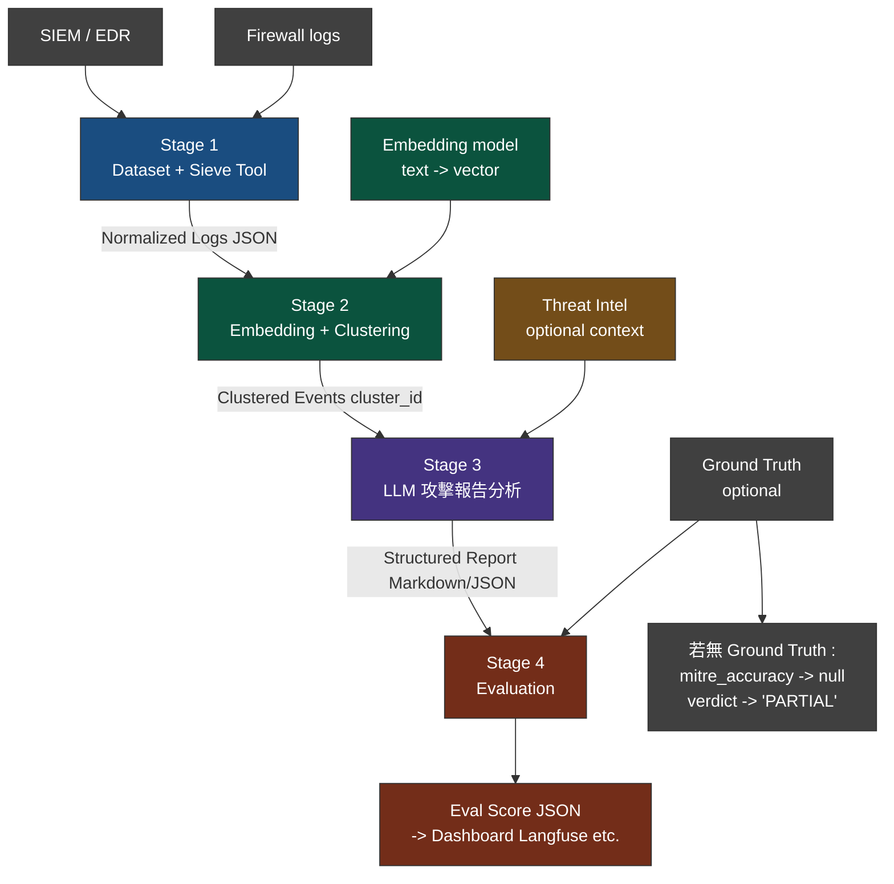

# 資安日誌分析與攻擊報告生成系統規格書 (Data Pipeline Specifications)

本文檔定義了「資安日誌分析與攻擊報告生成系統」四個核心階段的輸入（Input）與輸出（Output）資料規格、評估機制及整體落地架構，以確保端到端（End-to-End）資料流的整合性與嚴謹度。

---

## Pipeline

1. dataset + seive tool 抓 log
2. model 事件分群 / embbeding model 
3. LLM 分析 攻擊報告 
4. Evaluation



## 1. Dataset + Sieve Tool 抓 Log

本階段核心在於從異質資料源中，過濾、清洗並提取出與潛在攻擊關聯的關鍵欄位，最大化消除背景噪訊。

### 1.1 輸入 (Input)
* **原始日誌串流/檔案 (Raw Logs)**：來自 SIEM、防火牆、EDR、Windows Event Logs、Linux Syslog 或 VPC Flow Logs 的原始 JSON、CSV 或 Syslog 文本。
* **過濾規則 (Sieve Rules/Signatures)**：已知惡意特徵（如特定 IOC、特定惡意指令字串）、特定時間區間篩選條件、高風險事件 ID (Event ID) 篩選列表。

### 1.2 輸出 (Output)
* **結構化標準日誌 (Normalized Logs)**：過濾後的精簡日誌陣列，每筆日誌格式皆完成標準化（Normalization）。
    ```json
    [
      {
        "timestamp": "2026-05-27T10:00:00Z",
        "source_ip": "192.168.1.50",
        "dest_ip": "10.0.0.5",
        "event_id": "4688",
        "actor_user": "admin",
        "process_action_details": "sudo rm -rf /var/log/nginx",
        "raw_message": "May 27 10:00:00 host sudo: admin : TTY=pts/0 ; PWD=/home/admin ; USER=root ; COMMAND=/bin/rm -rf /var/log/nginx"
      }
    ]
    ```

---

## 2. Model 事件分群 / Embedding Model

本階段核心在於將巨量的結構化日誌，透過語意向量化與非監督式學習算法，聚合為數個獨立的「事件叢集（Event Clusters）」，以便進行批次威脅上下文分析。

### 2.1 輸入 (Input)
* **結構化標準日誌**：第 1 階段輸出之標準化日誌陣列。
* **特徵組合文本 (Text for Embedding)**：將每筆日誌的關鍵欄位組合成具備語意的特徵字串。
    * *範例*：`"User admin executed sudo rm -rf from IP 192.168.1.50 to 10.0.0.5 at 2026-05-27T10:00:00Z"`

### 2.2 輸出 (Output)
* **事件分群清單 (Clustered Events)**：以群組 ID（Cluster ID）為單位的結構化 JSON 陣列。
* **[實作保留條件]**：`representative_logs` 暫定為純字串陣列。為確保第 3 階段 LLM 精確排列攻擊時間線，後續工程實作時可評估將其修改為包含時間戳記的物件陣列（Object array with timestamps）。
    ```json
    {
      "cluster_id": "cluster_042",
      "total_count": 128,
      "time_range": {
        "start": "2026-05-27T10:00:00Z",
        "end": "2026-05-27T10:15:00Z"
      },
      "representative_logs": [
        "User admin executed sudo rm -rf from IP 192.168.1.50 at 10:00:00",
        "User admin cleared bash_history from IP 192.168.1.50 at 10:05:00"
      ],
      "involved_entities": {
        "ips": ["192.168.1.50", "10.0.0.5"],
        "users": ["admin"]
      }
    }
    ```

---

## 3. LLM 分析 攻擊報告

本階段將特定事件叢集的日誌資料與上下文輸入至大型語言模型（LLM），由其扮演高階資安專家（SOC Tier 3 Analyst），推導出具備完整脈絡的資安事件分析報告。

### 3.1 輸入 (Input)
* **特定叢集日誌內容**：第 2 階段輸出之特定 `cluster_id` 完整內容（包含代表性日誌、受影響實體與時間線）。
* **系統提示詞 (System Prompt)**：定義資安專家角色、推論邏輯邊界限制，以及報告標準格式要求（必須包含 MITRE ATT&CK 映射）。
* **外部上下文威脅情報 (Threat Intel Context)** *(選填)*：當前最新的威脅情資、已知攻擊者手法、相關漏洞資訊（CVE 描述）。

### 3.2 輸出 (Output)
* **攻擊事件報告 (Structured Attack Report)**：高度結構化的 Markdown 文本或 JSON 格式報告。
    ```markdown
    # 攻擊事件分析報告 - Cluster 042
    
    ## 1. 攻擊概述 (Summary)
    偵測到源自 192.168.1.50 的憑證權限提升與日誌清除行為，意圖掩蓋軌跡。
    
    ## 2. 攻擊時間線 (Timeline)
    * `10:00:00` - 用戶 admin 提權執行關鍵目錄刪除。
    * `10:05:00` - 清除歷史紀錄以隱蔽蹤跡。
    
    ## 3. MITRE ATT&CK 映射
    * **Tactic**: Defense Evasion (TA0005)
    * **Technique**: Indicator Removal (T1070)
    
    ## 4. 修復建議 (Remediation)
    隔離 IP 192.168.1.50，並停用 admin 帳號進行全面鑑識。
    ```

---

## 4. Evaluation (評估)

本階段透過自動化評估框架或觀測平台，驗證第 3 階段 LLM 生成報告的正確性、忠實度（有無幻覺）及資安專業判讀準確度，並將結果輸出至視覺化評分網站。

### 4.1 輸入 (Input)
* **預期黃金標準 (Ground Truth / Reference)** *(選填)*：資安專家預先針對該日誌集群標記的正確攻擊鏈與正確 MITRE 標籤。
* **原始上下文 (Context)**：第 2 階段輸入給 LLM 的原始日誌與集群上下文資訊。
* **實際輸出報告 (Actual Output)**：第 3 階段 LLM 實際生成的攻擊事件報告。

### 4.2 輸出 (Output)
* **評估指標得分 (Evaluation Metrics Score)**：量化的評分數據 JSON，直接推送至評分網站 Dashboard。
* **[條件式推理]**：若輸入之「預期黃金標準 (Ground Truth)」為缺失狀態，系統無法進行標準答案比對，此時 `scores` 中的 `mitre_accuracy` 欄位必須輸出 `null`，且整體 `verdict` 應降級輸出為 `"PARTIAL"`。
    ```json
    {
      "report_id": "rep_20260527_001",
      "cluster_id": "cluster_042",
      "scores": {
        "faithfulness": 0.95,
        "answer_relevance": 0.88,
        "mitre_accuracy": 0.90 
      },
      "verdict": "PASS",
      "cost_and_latency": {
        "tokens": 4120,
        "latency_sec": 8.5
      }
    }
    ```
    *(註：當 Ground Truth 為缺失狀態時，預期輸出範例為 `"mitre_accuracy": null` 且 `"verdict": "PARTIAL"`)*

---

## 五、 現有的 Evaluation 評分網站與框架

針對第四階段（Evaluation），業界與開源社群現有的視覺化評分與觀測解決方案如下：

### 1. 開源與專業資安評估框架 (可整合自建 UI)
* **DeepEval (Confident AI)**：被稱為 LLM 的 Pytest。提供現成的開源評估指標（如 G-Eval、正確性、幻覺度），並內建一個**評分網站 Dashboard**，可批次運行並在網頁上查閱得分趨勢。
* **LogEval / CyberBench**：學術與工業界針對「日誌分析」與「資安報告」打造的基準測試框架，定義了日誌異常檢測與摘要的評分標準（包含 Precision, Recall, F1-score）。

### 2. 商用/雲端 LLM 評估與觀測平台 (內建完整評分網站)
* **Langfuse / Phoenix (Arize AI) / LangSmith**：提供完整的 Web UI Dashboard。系統執行時透過 SDK 將第 1 到第 3 步的完整 Trace 紀錄下來，支援 **LLM-as-a-Judge** 自動評分或 **人工審查（Human-in-the-loop）** 介面（由資安專家在網頁上直接進行得分/扣分與打標籤）。

---

## 六、 最終報告評分指標設計 (Evaluation Metrics)

為確保評分網站能正確顯示「是否正確/得分」，評估模組應包含以下三個維度的核心指標：

| 評估維度 | 指標名稱 | 評估核心邏輯 |
| :--- | :--- | :--- |
| **事實正確性** | 實體提取準確度 | 檢查報告中的 IP、主機名、Hash 是否完全存在於原始 Log 中，防範 LLM 憑空捏造。 |
| | 時間線正確性 | 驗證報告推導的攻擊步驟順序，是否與 Log 中的 Timestamp 先後順序相符。 |
| **資安專業對齊** | MITRE ATT&CK 對齊度 | 利用 LLM-as-a-Judge，比對報告判定的 Tactic/Technique 是否與標準答案或黃金數據集一致。 |
| | 威脅嚴重級別評估 | 驗證 LLM 給出的風險評級（高/中/低）或 CVSS 分數是否客觀合理。 |
| **摘要品質** | 噪訊消除率 | 評估最終報告是否成功剔除了無關的正常背景日誌，準確聚焦於真實威脅。 |